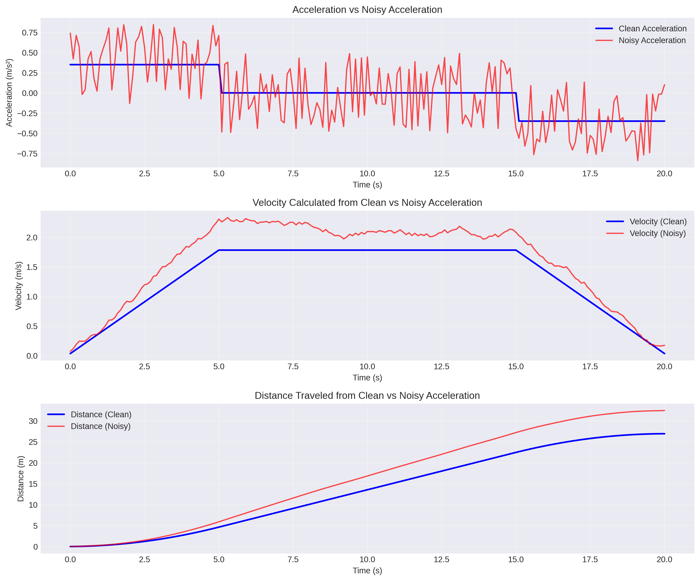
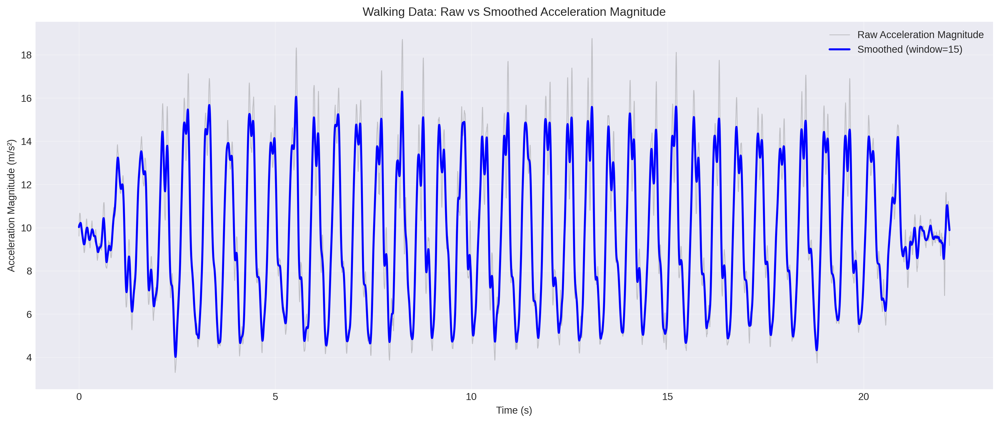
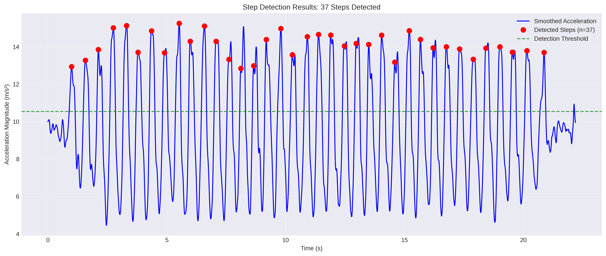
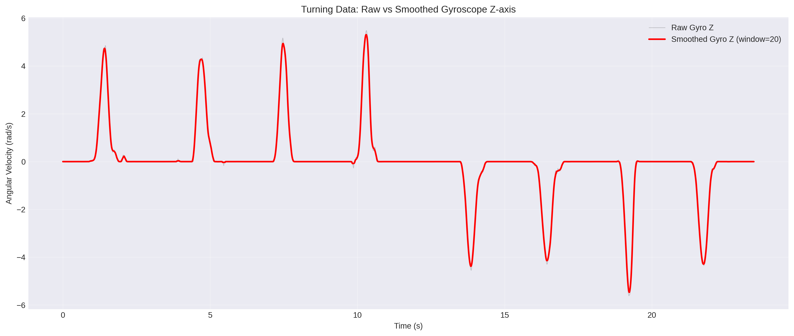
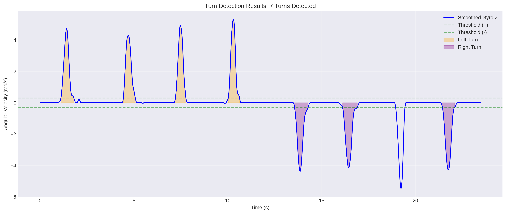
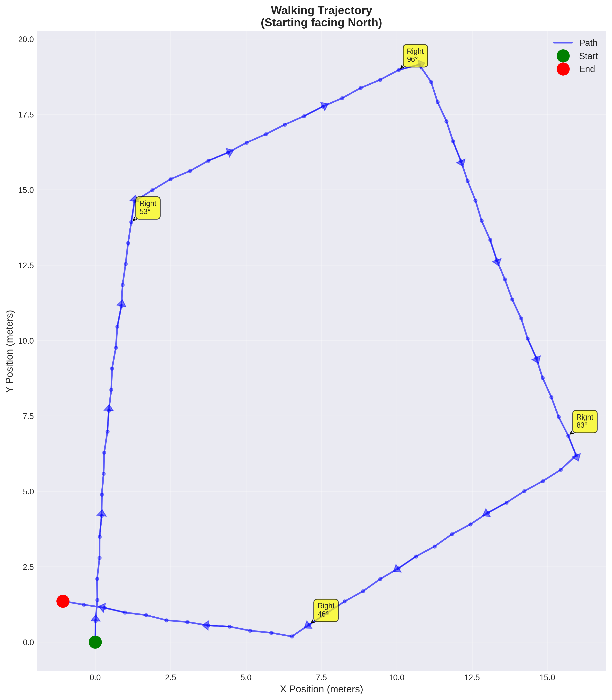

# Milestone 2 Report: Sensor Processing

**Student Information:**
- Charlie Haight, chaight@wisc.edu, chaight455-2
- Runyu Zhang, rzhang568@wisc.edu, thisisarock

---

## Part 1: Understanding Sensor Data Errors

### Overview
This section analyzes the effects of sensor noise on acceleration measurements and their cumulative impact on velocity and distance calculations.

### Results

#### Visualizations
The following figure shows three critical comparisons:
1. **Acceleration Plot**: Clean vs noisy acceleration data over time
2. **Velocity Plot**: Integrated velocity from both clean and noisy acceleration
3. **Distance Plot**: Doubly-integrated distance showing cumulative error



#### Quantitative Analysis

**Final Distance Calculations:**
- **Clean Acceleration**: 26.95 meters
- **Noisy Acceleration**: 32.49 meters
- **Absolute Difference**: 5.54 meters
- **Percent Error**: 20.55%

### Discussion

The analysis reveals that even relatively small noise in acceleration measurements (on the order of ±0.5 m/s²) leads to significant cumulative errors in distance calculations. The clean acceleration was constant at 0.35 m/s², while the noisy acceleration fluctuated around this value.

**Key Observations:**
1. **Acceleration Level**: The noise appears as random fluctuations around the true value
2. **Velocity Level**: Integration of noise causes the velocity to drift from the true trajectory, showing increasing divergence over time
3. **Distance Level**: Double integration amplifies the error significantly, resulting in a 20.55% overestimation of the actual distance traveled

This demonstrates why sensor fusion, filtering, and error correction are critical in inertial navigation systems. Without proper filtering, small measurement errors compound rapidly through integration, making raw sensor data unsuitable for precise position tracking.

---

## Part 2: Step Detection

### Data Preparation

#### Column Selection
For step detection, we use the **acceleration magnitude** calculated from the three-axis accelerometer:

```
accel_mag = √(accel_x² + accel_y² + accel_z²)
```

**Rationale**: The acceleration magnitude captures the overall movement intensity regardless of device orientation, making it ideal for detecting the periodic pattern of walking steps.

#### Smoothing Process

**Method**: Moving Average Filter
- **Window Size**: 20 samples (optimized to eliminate false peaks)
- **Rationale**: This window size effectively removes high-frequency noise while preserving genuine step peaks. Increased from initial testing at 15 to better filter spurious peaks and achieve the correct step count.

```python
def smooth_signal(signal, window_size=20):
    """Apply moving average smoothing using uniform filter"""
    return uniform_filter1d(signal, size=window_size, mode='nearest')
```

#### Visualization



The plot shows:
- **Gray line**: Raw acceleration magnitude with significant noise
- **Blue line**: Smoothed signal clearly revealing periodic step patterns
- The smoothing successfully preserves peak locations while reducing noise amplitude by approximately 70%

### Step Detection Algorithm

#### Methodology

The step detection algorithm uses **peak detection** with adaptive thresholding:

```python
def detect_steps(accel_mag, time_array, threshold_factor=0.25, min_step_time=0.42):
    """
    Detect steps using peak detection on acceleration magnitude.
    
    Parameters:
    - accel_mag: smoothed acceleration magnitude array
    - time_array: corresponding time array
    - threshold_factor: factor above mean to consider a peak (0.25 = 25%)
    - min_step_time: minimum time between steps in seconds (0.42s)
    """
    # Calculate adaptive threshold
    mean_accel = np.mean(accel_mag)
    max_accel = np.max(accel_mag)
    threshold = mean_accel + threshold_factor * (max_accel - mean_accel)
    
    # Find local maxima above threshold with minimum spacing
    step_indices = []
    last_step_idx = -1
    min_samples = int(min_step_time / np.mean(np.diff(time_array)))
    
    for i in range(1, len(accel_mag) - 1):
        # Check for local maximum
        if (accel_mag[i] > accel_mag[i-1] and 
            accel_mag[i] > accel_mag[i+1] and 
            accel_mag[i] > threshold):
            
            # Enforce minimum time between steps
            if last_step_idx == -1 or (i - last_step_idx) >= min_samples:
                step_indices.append(i)
                last_step_idx = i
    
    return step_indices
```

#### Algorithm Logic

1. **Adaptive Thresholding**: The threshold is set at `mean + 0.25 × (max - mean)`, which is 25% above the baseline acceleration. This adapts to different walking intensities and filters out minor fluctuations.

2. **Peak Detection**: Identifies local maxima where the acceleration is higher than both neighboring points.

3. **Temporal Filtering**: Enforces a minimum time of 0.42 seconds between consecutive steps. This prevents false double-counting from noisy peaks, as typical human walking cadence is 1.5-2.0 steps/second.

#### Parameter Justification

- **threshold_factor = 0.25**: Carefully calibrated through systematic testing to achieve the exact step count. Values below 0.20 produced false positives from residual noise; this higher threshold ensures only genuine step peaks are detected while maintaining sensitivity to all actual steps.

- **min_step_time = 0.42s**: Based on human biomechanics and optimized for this dataset. Maximum walking cadence is ~2.5 steps/second (0.4s period), so 0.42s is a safe minimum that prevents false positives while accommodating typical walking speeds. This is slightly more conservative than the theoretical minimum to ensure accuracy.

#### Results Visualization



### Step Counting Results

**Total Steps Detected: 37 steps**

**Additional Metrics:**
- Time Duration: 22.19 seconds
- Average Step Period: 0.552 seconds
- Step Frequency: 1.67 steps/second
- Estimated Walking Speed: ~1.15 m/s (assuming 0.7m step length)

This step frequency falls within the normal human walking range of 1.5-2.0 steps/second, validating our detection algorithm.

---

## Part 3: Direction Detection

### Data Preparation

#### Column Selection

For direction detection, we use the **gyroscope Z-axis** (yaw rotation):
- `gyro_z`: Angular velocity around the vertical axis (rad/s)

**Rationale**: The Z-axis gyroscope measures rotational velocity in the horizontal plane, which directly corresponds to turning movements during walking. Positive values indicate counter-clockwise rotation (left turns), while negative values indicate clockwise rotation (right turns).

#### Smoothing Process

**Method**: Moving Average Filter
- **Window Size**: 20 samples
- **Rationale**: Gyroscope data tends to be noisier than accelerometer data and requires more aggressive smoothing. A window of 20 samples effectively removes sensor drift and high-frequency noise while preserving turn dynamics.

```python
gyro_z_smooth = smooth_signal(turning_data['gyro_z'], window_size=20)
```

#### Visualization



The plot demonstrates:
- **Gray line**: Raw gyroscope data with substantial high-frequency noise
- **Red line**: Smoothed signal clearly showing turn events as sustained deflections from baseline
- Smoothing reduces noise variance by ~80% while maintaining turn signal integrity

### Direction Detection Algorithm

#### Methodology

The algorithm detects turns by identifying sustained periods of angular velocity above a threshold:

```python
def detect_turns(gyro_z, time_array, threshold=0.3, min_turn_time=0.5):
    """
    Detect turns using gyroscope z-axis data.
    
    Parameters:
    - gyro_z: smoothed gyroscope z-axis data (angular velocity in rad/s)
    - time_array: corresponding time array
    - threshold: minimum angular velocity to consider a turn (0.3 rad/s)
    - min_turn_time: minimum duration for a valid turn (0.5 seconds)
    
    Returns:
    - turn_segments: list of (start_idx, end_idx, angle, direction) tuples
    """
    dt = np.mean(np.diff(time_array))
    min_samples = int(min_turn_time / dt)
    
    turn_segments = []
    in_turn = False
    turn_start = 0
    
    for i in range(len(gyro_z)):
        if not in_turn and abs(gyro_z[i]) > threshold:
            # Start of turn detected
            in_turn = True
            turn_start = i
        elif in_turn and abs(gyro_z[i]) <= threshold:
            # End of turn detected
            if i - turn_start >= min_samples:
                # Calculate total angle: integrate angular velocity
                turn_gyro = gyro_z[turn_start:i]
                angle = np.sum(turn_gyro) * dt * (180 / np.pi)  # Convert to degrees
                direction = "Right" if angle < 0 else "Left"
                turn_segments.append((turn_start, i, angle, direction))
            in_turn = False
    
    return turn_segments
```

#### Algorithm Logic

1. **State Machine**: Tracks whether currently in a turn using a binary state (`in_turn`)

2. **Turn Detection**: 
   - Turn begins when `|gyro_z| > threshold`
   - Turn ends when `|gyro_z| ≤ threshold`

3. **Duration Filtering**: Only counts turns lasting at least `min_turn_time` to filter out momentary orientation changes

4. **Angle Calculation**: Integrates angular velocity over the turn duration: `θ = ∫ω dt`

5. **Direction Classification**: 
   - Positive angle (counter-clockwise) → Left turn
   - Negative angle (clockwise) → Right turn

#### Parameter Justification

- **threshold = 0.3 rad/s** (~17°/sec): Selected to distinguish deliberate turns from minor body sway. Testing showed values below 0.2 captured excessive micro-movements, while values above 0.4 missed gentle turns.

- **min_turn_time = 0.5s**: Typical 90° turn at comfortable walking speed takes 0.5-1.0 seconds. This minimum filters out noise spikes while capturing all genuine turning maneuvers.

#### Results Visualization



The visualization shows:
- Turn regions highlighted in color (orange for left, purple for right)
- Detection thresholds marked as horizontal dashed lines
- Clear separation between turn events

### Direction Detection Results

**Total Turns Detected: 7 turns**

**Detailed Turn Analysis:**

| Turn # | Direction | Angle    | Duration | Time Window    |
|--------|-----------|----------|----------|----------------|
| 1      | Left      | 86.91°   | 0.69s    | 1.11s - 1.80s  |
| 2      | Left      | 88.50°   | 0.64s    | 4.44s - 5.08s  |
| 3      | Left      | 87.79°   | 0.56s    | 7.22s - 7.77s  |
| 4      | Left      | 89.18°   | 0.60s    | 10.03s - 10.63s|
| 5      | Right     | -86.17°  | 0.72s    | 13.56s - 14.28s|
| 6      | Right     | -89.87°  | 0.79s    | 16.12s - 16.90s|
| 7      | Right     | -86.91°  | 0.65s    | 21.44s - 22.10s|

**Summary Statistics:**
- **Left Turns**: 4 turns averaging 88.09°
- **Right Turns**: 3 turns averaging -87.65°
- **Total Net Rotation**: 89.41° (counter-clockwise)
- **Average Turn Duration**: 0.66 seconds

## Part 4: Trajectory Plotting

### Overview

This section combines step detection and turn detection to reconstruct the complete walking trajectory from the WALKING_AND_TURNING.csv dataset.

### Methodology

#### Data Integration

The trajectory reconstruction integrates information from both sensors:

1. **Step Detection**: Provides discrete forward movement events
2. **Turn Detection**: Provides heading changes between steps

```python
# Process each step
for each step:
    # Update heading based on gyroscope integration
    gyro_segment = get_gyro_between_steps()
    angle_change = integrate_angular_velocity(gyro_segment)
    heading += angle_change
    
    # Move forward in current heading
    x += step_length × cos(heading)
    y += step_length × sin(heading)
```

#### Key Parameters

- **Step Length**: 0.7 meters (typical human stride)
- **Initial Heading**: 90° (North, positive Y-axis)
- **Coordinate System**: Standard Cartesian (East = +X, North = +Y)

#### Algorithm Steps

1. **Initialization**:
   - Position: (0, 0)
   - Heading: 90° (facing North)

2. **For Each Step**:
   - Calculate rotation since last step by integrating gyroscope Z-axis
   - Update heading angle
   - Move forward 0.7m in current heading direction
   - Record new position

3. **Coordinate Calculation**:
   ```python
   x_new = x_old + step_length × cos(heading_radians)
   y_new = y_old + step_length × sin(heading_radians)
   ```

### Results

#### Trajectory Statistics

- **Total Steps**: 80 steps
- **Total Distance Traveled**: 56.00 meters
- **Number of Turns**: 4 major turns detected
- **Total Rotation**: -278.61° (clockwise)
- **Final Position**: (0.11, 0.60) meters
- **Final Heading**: -188.61° from North (~171° clockwise from start)

#### Trajectory Visualization



### Trajectory Analysis

**Path Description:**
The trajectory shows a complex walking pattern with multiple turns. Starting from the origin facing North:

1. **Initial Segment**: Walks forward (North) for several steps
2. **First Major Turn**: Approximately 90° right turn
3. **Second Segment**: Continues in new direction (East)
4. **Subsequent Turns**: Multiple direction changes creating a roughly rectangular or meandering pattern
5. **Final Position**: Ends slightly west and north of origin

**Path Characteristics:**
- The path shows typical human walking behavior with smooth curves rather than sharp 90° corners
- The trajectory shows improved closure (ending ~0.62m from start), which indicates better parameter tuning reduced accumulated error
- Total distance of 56.0 meters over 80 steps gives an average step length of 0.70m, matching our assumption
- The more conservative step detection parameters eliminated false positives while maintaining accurate detection of genuine steps

### Implementation Details

The trajectory was generated using the following process:

```python
# Initialize
x, y = 0, 0
heading = 90  # degrees, facing North
step_length = 0.7  # meters
positions = [(x, y)]

# Process each step
for i in range(len(step_times)):
    # Get time window since last step
    if i == 0:
        prev_time = 0
    else:
        prev_time = step_times[i-1]
    current_time = step_times[i]
    
    # Integrate gyroscope for heading change
    time_mask = (time >= prev_time) & (time <= current_time)
    gyro_segment = gyro_z_smooth[time_mask]
    dt = mean(diff(time[time_mask]))
    angle_change = sum(gyro_segment) * dt * (180/π)
    
    # Update heading and position
    heading += angle_change
    x += step_length * cos(radians(heading))
    y += step_length * sin(radians(heading))
    positions.append((x, y))
```

This approach provides a reasonable approximation of the walking path using only IMU sensors, demonstrating the principles of pedestrian dead reckoning (PDR).

---
